# Avatax plugin for Craft CMS 5.x

Calculate and add sales tax to an order's base tax using Avalara's AvaTax service.

<a href="https://help.avalara.com/001_Avalara_AvaTax/Find_Your_Home_Page/CraftCommerce_by_Surprise_Highway">
	
</a>

## Requirements

This plugin requires Craft 5 and Commerce 5 or later.

## Installation

To install the plugin, follow these instructions.

1. Open your terminal and go to your Craft project:

        cd /path/to/project

2. Then tell Composer to load the plugin:

        composer require surprisehighway/craft-avatax

3. In the Control Panel, go to Settings → Plugins and click the “Install” button for Avatax.

## Setup Overview

Setup and configuration is detailed below, but here's a quick overview of what you'll need to do get started:

1. Configure the plugin settings with your Avalara account info and test the connection.
2. Configure the plugin settings with your origin address and default tax codes.
3. Set the "Avatax" tax category to be available to your product types.
4. Assign the "Avatax" tax category to your products.
4. Optionally add the product-specfic tax code field to your Product Type fields to allow per-product tax codes.
5. Optionally add the customer usage type field to your User fields to set up tax-exempt customers.

## Configuring AvaTax Account Connection

1. Visit the settings page at Settings → Avatax
2. Enter your the Account ID, License Key, and Company code credentials for each environment.
3. Selecting *Sandbox* or *Production* will enable the chosen environment.
4. Click the *Test Connection* button to verify your connection.
5. Click the *Save* button to save your settings.

> Hint: it is recommended to use [Environment Variables](https://craftcms.com/docs/3.x/config/#environmental-configuration) for the following settings: Account ID, License Key, Company Code, Sandbox Account ID, Sandbox License Key, Sandbox Company Code to prevent sensitive info being saved in Project Config or the database. See [Config Overrides](#config-overrides) below for more examples.

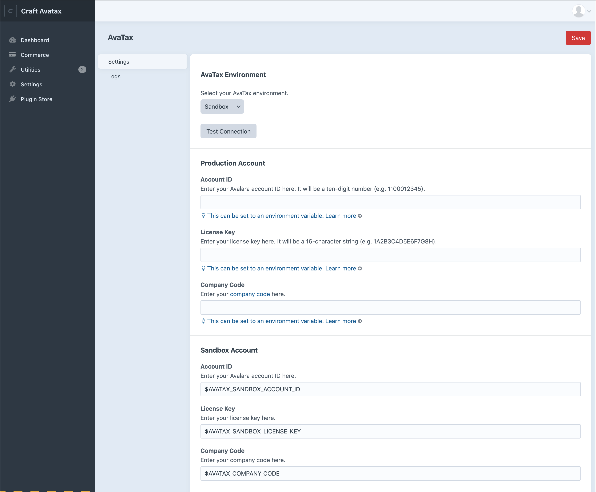

## Configuring AvaTax Ship From Origin

1. Specify a valid origin address to ship from.
2. Click the *Save* button to save your settings.

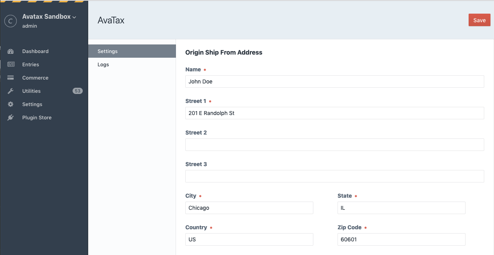

## Configuring AvaTax Plugin Options

1. Visit the settings page at Settings → Avatax
2. *Tax Calculation Enabled* - enable or disable tax calculation independantly of other settings.
3. *Committing Enabled* - enable or disable document committing.
4. *Address Validation Enabled* - enable or disable Avalara's address verification.
5. *Debugging enabled* - while setting up and testing enable debugging to log all API interactions. Be sure to disable once live.
6. Click the *Save* button to save your settings.

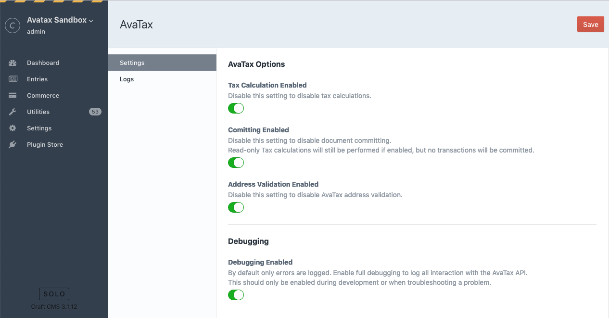

## Using AvaTax

1. Visit Commerce → Settings → Tax Categories. A tax category with the handle "avatax" should exist, if not, create one.

	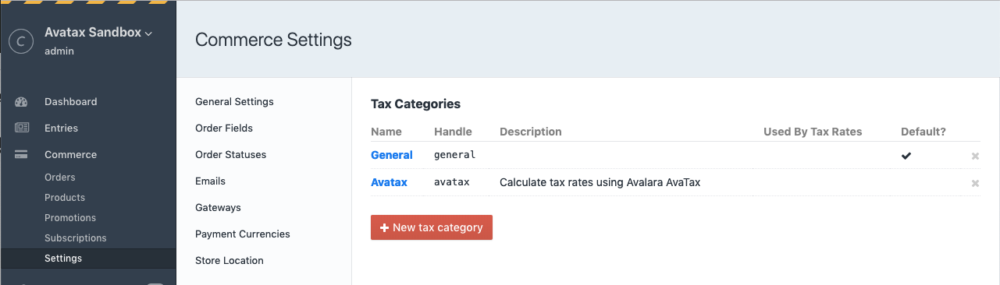

2. Click the Avatax Tax Category. Check the product type(s) the Avalara Tax Rates will be available to.

	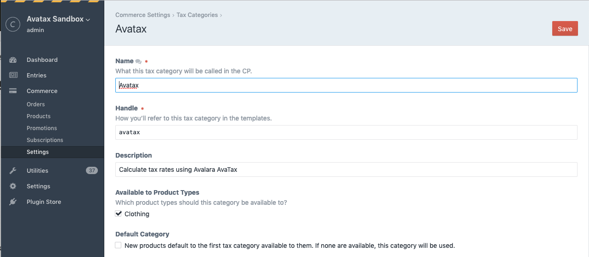

After completing the installation and configuration, AvaTax will calculate and apply sales tax to all orders with a valid shipping address for products with the Avatax tax category selected.

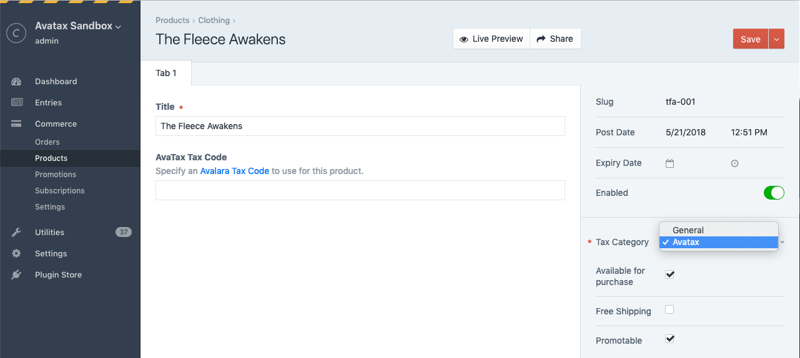

> **Craft 5 Hint:** The Tax Category dropdown is no longer in the product details sidebar. You have to double-click a Variant to see see the Tax and Shipping Categories in the Variant flyout (and make sure the sidebar is visible). If you don't need to be able to use different Tax Categories for different products make sure Avatax is your default.

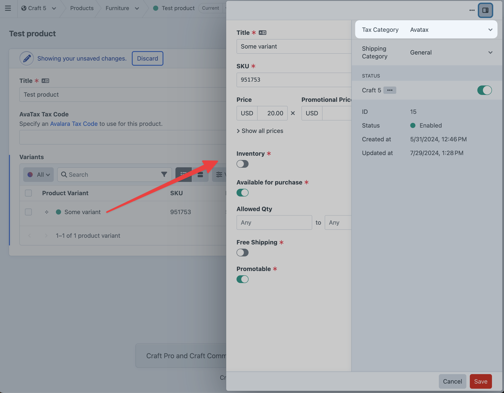

## Tax Codes

*E.g. 'P0000000' - Tangible personal property (TPP)*.

You can set the default [Avalara Tax Code](https://taxcode.avatax.avalara.com/) by setting the Default Tax Code value in the plugin settings. This is the default tax code that will get sent to Avalara for all products.

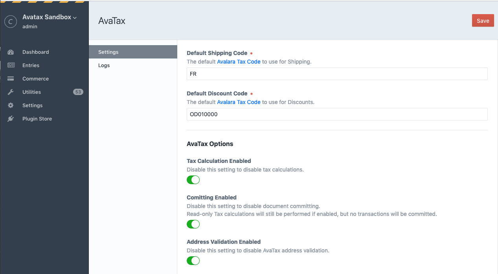

You can also set a specific Tax Code for each product by adding a custom field to your Products.

#### To set up the product field:

1. Visit Settings → Fields. You should see a field named "AvaTax Tax Code" that was created during plugin installation. If not create, one. Note that the field "Name" can be anything you'd like, e.g. "AvaTax Tax Code" or "Product Tax Code", but the field "Handle" must match `avataxTaxCode` and is case sensitive.
2. Visit Commerce → Settings → Product Types and click the name of your Product Type.
2. Click the *Product Fields* tab.
3. Add the AvaTax Tax Code field and save.

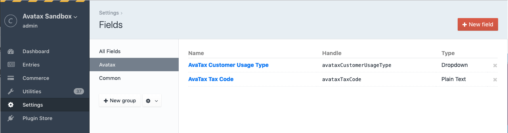

In your product entries you can now enter any text to send along as the AvaTax Tax Code. If this field does not exist or is left empty the default tax code setting in your config file will be used.

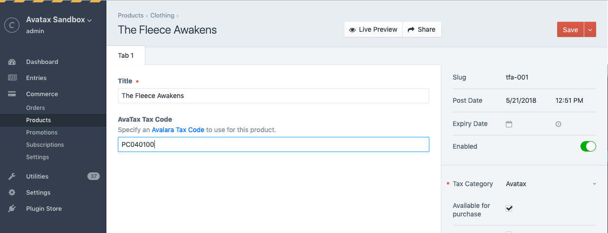

> Hint: By default the field is plain text, but you could change it to a dropdown with pre-configured values for your use case as long as the handle stays the same.

## Shipping Codes

*E.g. 'FR' - Shipping Only - common carrier - FOB destination.*

Shipping charges are sent as a separate line item to AvaTax. You can set your default [Avalara Tax Code](https://taxcode.avatax.avalara.com/) for shipping charges by setting the Default Shipping Code in the plugin settings.


## Tax-Exempt Customers

You can specify a customer to be exempt from tax by adding a custom field to your User settings which is used to specify an [Avalara Entity/Use Code](https://help.avalara.com/000_Avalara_AvaTax/Exemption_Reason_Matrices_for_US_and_Canada).

#### To set up the User field:

1. Visit Settings → Fields. You should see a field named "AvaTax Customer Usage Type" that was created during plugin installation. If not create, one. Note that the field "Name" can be anything you'd like, e.g. "AvaTax Customer Usage Type" or "Entity/Use Code", but the field "Handle" must match `avataxCustomerUsageType` and is case sensitive.
2. Visit Settings → Users → Fields.
3. Add the AvaTax Customer Usage Type field and save.


In your User accounts you can now set an Entity/Use Code to send to Avalara. It is up to you how you implement this for your users if you allow them to edit their own profiles on the front-end, but this will most likely remain an administrative task in most cases.

This necessarily requires a registered User to be logged in during checkout, not guest checkouts.

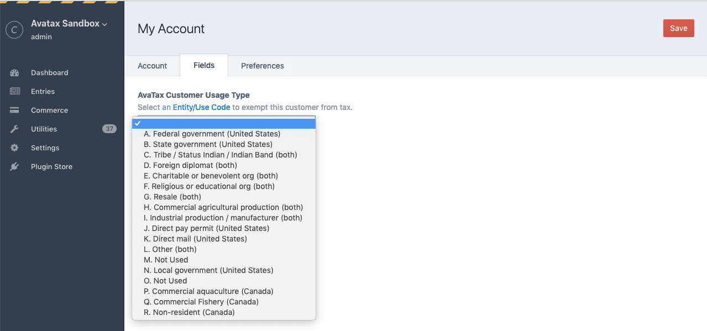

> Hint: By default this dropdown field contains all the default Avalara Entity/Use Codes but you can edit the options to customize for own use case or if you’ve set up custom codes via the AvaTax website.

## Promotions

Promotions are supported. For Sales, the sale price is simply sent to Alavara as the Line Item amount. Discounts are sent as a separate line item using the *Default Discount Code* plugin setting as the Avalara Tax Code.

## Refunds

Craft Commerce supports refunds for completed transactions if the [payment gateway](https://craftcommerce.com/support/which-payment-gateways-do-you-support) supports refunds. If refunds are supported for an order Commerce displays a "Refund" button in the order’s Transaction history. 

As of Commerce 2.0 partial refunds can be initiated multiple times from the admin control panel. Triggering a full refund for the exact amount of the original order will issue a new Return Invoice for full amount of the corresponding AvaTax transaction. Be aware that triggering a partial refund will issue a new Return Invoice for the partial amount to the corresponding AvaTax *customer* but is not tied to the original transaction. This is because AvaTax only issues refunds on a transaction in full, for specific line items, or as a percentage.

## Customer Code

By default the plugin will send Avalara the order email address as the customer code. With this "hidden" feature you can optionally override this behavior to use the value saved in a User or Order field with a specific handle. This field is **not** created automatically when you install the plugin, you must manually create it.

#### To set up the field:

1. Create either a User or Order field named "Avatax Customer Number", with the handle `avataxCustomerCode`. The handle must match exactly and is case sensitive.

Note that it is up to you how you save or validate the field value. The plugin will simply use the field value if available, or default to the order email address if the field is empty or does not exist.


## Config Overrides

You can use Craft's [plugin config file](https://docs.craftcms.com/v3/extend/plugin-settings.html#overriding-setting-values) support to override many of the plugin settings in the control panel. This is handy to "lock down" certain settings, and also to provide [per-environment settings](https://docs.craftcms.com/v3/config/environments.html#config-files).

1. Copy `config.php` from the `avataxtax` directory to your craft/config folder and rename it to `avatax.php`
2. Update values in `avatax.php` and save.

It is recommended to use ENV variables to following account settings:

.ENV file:
```
AVATAX_ACCOUNT_ID=123456
AVATAX_LICENSE_KEY=987654321
AVATAX_COMPANY_CODE=MYCOMPANY
AVATAX_SANDBOX_ACCOUNT_ID=123456
AVATAX_SANDBOX_LICENSE_KEY=987654321
AVATAX_SANDBOX_COMPANY_CODE=MYCOMPANY

```

config/avatax.php:
```
<?php

return [
    '*' => [
        // The address you will be posting from.
        'shipFromName'    => 'John Doe',
        'shipFromStreet1' => '201 E Randolph St',
        'shipFromStreet2' => '',
        'shipFromStreet3' => '',
        'shipFromCity'    => 'Chicago',
        'shipFromState'   => 'IL',
        'shipFromZipCode' => '60601',
        'shipFromCountry' => 'US',

        // The default Avalara Tax Code to use for Products.
        'defaultTaxCode' => 'P0000000',

        // The default Avalara Tax Code to use for Shipping.
        'defaultShippingCode' => 'FR',

        // The default Avalara Tax Code to use for Discounts.
        'defaultDiscountCode' => 'OD010000',

        // Production account information from ENV.
        'accountId'          => '$AVATAX_ACCOUNT_ID',
        'licenseKey'         => '$AVATAX_LICENSE_KEY',
        'companyCode'        => '$AVATAX_COMPANY_CODE',

        // Sandbox account information from ENV.
        'sandboxAccountId'   => '$AVATAX_SANDBOX_ACCOUNT_ID',
        'sandboxLicenseKey'  => '$AVATAX_SANDBOX_LICENSE_KEY',
        'sandboxCompanyCode' => '$AVATAX_SANDBOX_COMPANY_CODE',

        // Environment - 'production' or 'sandbox'.
        'environment' => 'sandbox',

        // AvaTax options - true or false
        'enableTaxCalculation'    => true,
        'enableCommitting'        => true,
        'enableAddressValidation' => false,
        'enablePartialRefunds'    => true,
        
        // Enable debugging - true or false
        'debug' => true,
    ],

    'production' => [
        // Environment - 'production' or 'sandbox'.
        'environment' => 'production',

        // Enable debugging - true or false
        'debug' => false,
    ],

];
```

## Form Input Overrides

You can use hidden form input fields to override the plugin Tax Calculation setting.

To disable tax calculation for a form even if the plugin’s Tax Calculation setting is enabled add the following input to your form:

```
<input type="hidden" name="avatax_disable_tax_calculation" value="1">
```
...or the twig helper
```
{{ hiddenInput('avatax_disable_tax_calculation', 1) }}
```

To force tax calculation for a form even if the plugin’s Tax Calculation setting is disabled add the following input to your form:

```
<input type="hidden" name="avatax_disable_tax_calculation" value="1">
```
...or the twig helper
```
{{ hiddenInput('avatax_force_tax_calculation', 1) }}
```

> Note: This setting will not force a new API request if the Avatax response is already cached. It will just force the plugin to behave as if the setting was enabled.

The values are parsed using the PHP validate filter [FILTER_VALIDATE_BOOLEAN](https://www.php.net/manual/en/filter.filters.validate.php) so values return true for "1", "true", "on" and "yes". Returns false otherwise.

## Ajax Examples

There is a JSON controller endpoint you can use for AJAX lookups/validation on the front-end. Currently the only endpoints are for address validation and [CertCapture](https://certcapture6xrest.docs.apiary.io) customer lookup by customer number.

#### AJAX Address Validation

You can use an ajax lookup on the front-end to call the AvaTax [Resolve Address API](https://developer.avalara.com/avatax/address-validation/). Note if you implement this on the front-end you may want to disable address validation in the plugin settings to avoid more API calls during the checkout process (the JSON endpoint will still work).

This example uses the default Commerce 2 address form fields and jQuery to perform the AJAX call to give you a starting point, however jQuery is not required and it is up to you to implement as your checkout flow requires.

```


    $('#address-form').on('submit.addressValidation', function(e) {

        e.preventDefault();

        var $form = $(this);

        var data = {
            address1   : $('[name="shippingAddress[address1]"]').val(),
            address2   : $('[name="shippingAddress[address2]"]').val(),
            city       : $('[name="shippingAddress[city]"]').val(),
            zipCode    : $('[name="shippingAddress[zipCode]"]').val(),
            stateValue : $('[name="shippingAddress[stateValue]"]').val(),
            countryId  : $('[name="shippingAddress[countryId]"]').val()
        };

        var csrfTokenName  = "{{ craft.app.config.general.csrfTokenName }}";
        var csrfTokenValue = "{{ craft.app.request.csrfToken }}";

        data[csrfTokenName] = csrfTokenValue;

        $.ajax({
            type: 'post',
            url: '/actions/avatax/json/validate-address', 
            data: data,
            dataType: 'json'            
        }).done(function(data){

            console.log(data);

            if(data.success) {
                // valid address
                $form.off('submit.addressValidation').submit();
            } else {

                // handle error here...

                return false;
            }
        });
    });


```

#### CertCapture Customer Lookup

An example use case for passing along a custom [Customer Code](https://github.com/surprisehighway/craft-avatax/tree/dev-certcapture#customer-code) to AvaTax is that if a matching customer is found in a connected [CertCapture](https://www.avalara.com/us/en/products/sales-and-use-tax/certcapture.html) account any tax-exemptions based on certificates for that customer are automatically applied in AvaTax.

In this case you may want to validate a customer number field to see if a matching customer is found in CertCapture before passing it along to AvaTax.

Before using this API you'll need to add your CertCapture credentials to your  `config/avatax.php` file.

```
<?php

return [

    // ... other settings ...

    'certCaptureUsername' => 'username',
    'certCapturePassword' => 'password',
    'certCaptureClientId' => '123456',

];
```

This example demonstrates a potential button click handler that triggers a customer number lookup in CertCapture via an AJAX request to the plugin's JSON endpoint. The plugin will return success and the CertCapture response with customer info if a matching customer is found, or an error if a match is not found. Note that it appears the CertCapture customer number is case sensitive. jQuery is not required and it is up to you to implement as your checkout flow requires.

```

    
    $('button.validate-customer').on('click', function(e) {

        e.preventDefault();

        var data = { number: $('[name="fields[avataxCustomerCode]"]').val() };

        var csrfTokenName  = "{{ craft.app.config.general.csrfTokenName }}";
        var csrfTokenValue = "{{ craft.app.request.csrfToken }}";

        data[csrfTokenName] = csrfTokenValue;

        $.ajax({
            type: 'post',
            url: '/actions/avatax/json/cert-capture-customer', 
            data: data,
            dataType: 'json'            
        }).done(function(data){

            console.log(data);

            if(data.success) {

                // customer found, show valid state or submit form...

            } else {

                // invalid customer number, handle error here...
            }
        });
    });



```
## Events

You can cancel AvaTax tax calculation for a given Commerce `Order` by listening for a cancelable event fired just before calculation begins.

```php
<?php

use yii\base\Event;
use surprisehighway\avatax\events\BeforeCreateSalesOrderEvent;
use surprisehighway\avatax\services\SalesTaxService;

Event::on(
    SalesTaxService::class,
    SalesTaxService::EVENT_BEFORE_CREATE_SALES_ORDER,
    function (BeforeCreateSalesOrderEvent $event) {
        // Example rule: skip tax calculation for carts in a specific state
        $order = $event->order;
        if (!order->myCustomField === true) {
            $event->isValid = false; // Cancel AvaTax calculation for this order

            $event->handled = true; // Optionally prevent other event handlers from overriding.
        }
    }
);
```

## AvaTax Plugin Roadmap

Some things to do, and ideas for potential features:

* Better exception handling
* Config settings for default tax codes at the Product Type level.

---

Brought to you by [Surprise Highway](http://surprisehighway.com)
